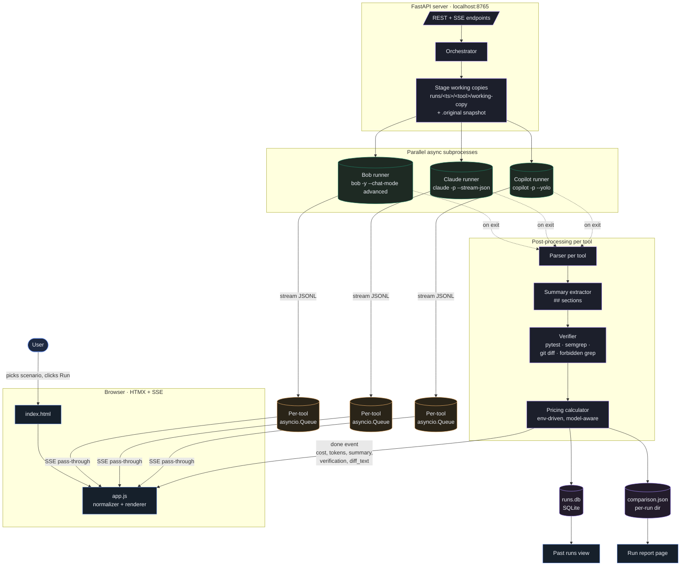

# Coding Tool Bake-off

A local web app that benchmarks **IBM Bob Shell**, **Anthropic Claude
Code**, and **GitHub Copilot CLI** side-by-side on identical coding
scenarios, for example, a vulnerable Flask e-commerce app with SQL
injection in the product search endpoint that each tool must find, fix,
and test. Each tool gets a fresh isolated copy of the repo, streams its
work into a three-column live UI, and produces an objectively verified
report with cost, time, tokens, tests added, the git diff of changes,
and the security verdict.

## Prerequisites

You need active accounts for each tool, and their CLIs installed
locally. All three are Node-based command-line clients:

- **IBM Bob Shell**: an IBM-internal Bob account with Bobcoins
  available. CLI binary: `bob` (installed via the IBM extension
  marketplace or `npm`-style install per IBM's internal docs).
- **Anthropic Claude Code**: a `claude.ai` account with Claude Code
  access. CLI binary: `claude` (`npm i -g @anthropic-ai/claude-code`).
- **GitHub Copilot CLI**: a GitHub account with Copilot Pro / Business.
  CLI binary: `copilot` (`npm i -g @github/copilot`).

`setup.sh` installs the three CLIs, Python deps via `uv`, and
`semgrep`, then prints the exact `/login` flow for each. You log in
once per machine; the harness runs non-interactively after that.

## Quick start (macOS)

```bash
./setup.sh                       # installs everything + prints login steps
./bakeoff serve                  # web UI at http://localhost:8765
./bakeoff run 01-sqli-flask      # CLI run with terminal output
```

`setup.sh` ends with the exact login steps for each CLI (Bob to keychain,
Claude to `/login`, Copilot to `/login`). Do those once, then runs work
non-interactively.

## Architecture



The orchestrator stages each tool in its own working copy, runs the
three CLIs concurrently, and post-processes per-tool the moment each
finishes (so cost/tokens/verification land in the UI without waiting
for the slowest tool). Working copies are sacred: no tool can see
another's files, and a `.original/` snapshot lives alongside for
diffing.

## Repo layout

```
.
├── setup.sh                       # one-shot macOS installer
├── bakeoff                        # CLI entry (./bakeoff run, serve, runs, scenarios)
├── pyproject.toml                 # Python deps (uv-managed)
├── .env / .env.example            # Pricing + auth + runtime knobs
├── .bob/custom_modes.yaml         # "Test Scenario Builder" Bob mode for adding scenarios
├── src/
│   ├── server.py                  # FastAPI app + SSE
│   ├── orchestrator.py            # Parallel run mgmt + working-copy isolation
│   ├── cli.py                     # argparse entry for ./bakeoff
│   ├── display_labels.py          # Shared tool-label formatting
│   ├── runners/                   # bob, claude, copilot subclassing base.py
│   ├── parsers/                   # Per-tool JSONL to cost/tokens/text
│   ├── pricing/                   # rates.yaml + env-driven calculator
│   ├── scoring/                   # summary_extractor + objective_verifier (incl. diff)
│   ├── models/run_result.py       # Dataclasses
│   └── storage/db.py              # SQLite read/write
├── scenarios/
│   └── 01-sqli-flask/             # SQLi-in-Flask scenario (canonical template)
│       ├── repo/                  # The vulnerable app the tools work on
│       ├── prompt.txt             # The prompt all 3 tools receive
│       ├── ground-truth.yaml      # What "correct" means
│       └── verify.sh              # Binary pass/fail check
├── frontend/
│   ├── templates/{index,report}.html
│   └── static/{app.js, diff_render.js, style.css, logos/*.svg}
├── runs/                          # Per-run output (gitignored)
└── tests/                         # Harness test suite (parsers, pricing, verifier)
```

## Scenarios

A **scenario** is a self-contained folder under `scenarios/` holding a
starter codebase, a prompt, and the rules for scoring it. Pick one in
the UI and the same task is handed to all three agents. What differs
is *how* each one solves it.

### Example: `01-sqli-flask`

A small Flask + SQLAlchemy storefront with a classic SQL injection
planted in the product-search endpoint: the SQL is built with an
f-string around the user-supplied `q` parameter, so `?q=' OR '1'='1`
dumps the entire catalog. Each agent has to find the bad line, swap it
for a parameterized / ORM-bound query, and add a test that proves the
fix holds.

### What a run actually does

1. **Isolate**: the scenario repo is copied into a fresh working
   directory per tool. Bob, Claude, and Copilot never see each other's
   files, and the harness keeps an untouched snapshot so it can diff
   afterwards.
2. **Run in parallel**: all three CLIs launch at once with the same
   prompt and start streaming their work into the three-column UI.
3. **Verify objectively**: when a tool finishes, the harness runs the
   real checks against its working copy: the test suite (`pytest`),
   the security scanner (`semgrep`), the "the bad pattern must be
   gone" grep, and the binary `verify.sh`. Cost / tokens / model come
   from the tool's own self-report.
4. **Save**: each tool's result is persisted to `runs.db` so you can
   reopen it later.

The agents don't wait for each other: Bob's verdict appears the
moment Bob finishes, even if Copilot is still typing.

### What you see at the end

- **Three live columns**: Background pane (tool calls happening in
  real time) and Answer pane (the agent's `## TASK SUMMARY` /
  `## CODE CHANGES` / `## TESTS ADDED` / `## TEST RESULTS` sections)
  with a verification footer per tool.
- **Comparison table**: every metric side-by-side: wall clock, USD
  cost, model, tokens, tests passed, Issue resolved, lines changed.
  Fastest time and lowest cost are highlighted.
- **How we computed each cost**: per-tool math cards with the actual
  formula (Copilot = tokens × per-MTok rate, Bob = Bobcoins × USD/coin,
  Claude = its own self-report), linked back to the upstream rate cards
  so the price is defensible.
- **What each tool changed**: GitHub-style unified `git diff` per
  tool: green/red rows, line-number gutters, file + hunk banners. The
  agents' internal scratchpads (`.bob/`, `.claude/`, `.copilot/`) are
  hidden so you only see real code changes.
- **Past runs**: every bake-off is saved. "View past runs" opens any
  prior run in the same report layout, so demos and review meetings
  read identically to a live session.

## Pricing

Pricing config lives in `.env` (top level). Two knobs you'll actually
edit:

- `BOB_USD_PER_BOBCOIN=0.50`: 1 Bobcoin = $0.50 USD.
- `COPILOT_DISPLAY_AS_MODEL=claude-sonnet-4.6`: Copilot using
  post-June-1-2026 token-based rates (Sonnet: $3/$15/$0.30 per MTok
  input/output/cached). Audit trail kept in
  `extras.pricing.actual_model` and `rate_source` for defensibility.

Claude reports `total_cost_usd` directly (passthrough, no config
needed). Full per-model rate table lives in `src/pricing/rates.yaml`;
override any specific rate via
`COPILOT_RATE_<MODEL>_{INPUT,OUTPUT,CACHED}_PER_MTOK` env vars if a
customer's contract differs.

## Adding a new scenario

### Universal mechanism (all scenario types use this)

Every scenario uses the **same two checks**, no exceptions:

1. **`pytest`** runs in `repo/` and auto-discovers every test file in
   `repo/tests/`. The tool adds new tests there directly; pytest
   picks them up with zero config.
2. **`verify.sh`** is the binary pass/fail. Its exit code drives the
   `Issue resolved ✓/✗` row in the UI. This is where scenario-specific
   logic lives (semgrep, curl, timing, whatever).

The scenario *type* only changes **what verify.sh asserts** beyond pytest:

| Type            | Starting code state              | Tool's job                          | What `verify.sh` asserts                                          |
|---|---|---|---|
| `vulnerability` | tests pass; vuln present         | fix vuln + add regression test      | pytest + Semgrep clean + forbidden pattern gone                   |
| `feature`       | tests pass; feature missing      | add feature + add tests for it      | pytest + custom "feature exists" check (e.g., curl / import)      |
| `refactor`      | tests pass; code is ugly         | refactor — tests still pass         | pytest + forbidden pattern (old code shape) gone                  |
| `bugfix`        | tests pass; don't cover the bug  | add failing test + fix the bug      | pytest (the regression test now exists and passes)                |
| `performance`   | tests pass; code is slow         | optimize — tests still pass         | pytest + timing assertion (fails if duration > threshold)         |

The matrix is also documented inline in
[`scenarios/01-sqli-flask/ground-truth.yaml`](scenarios/01-sqli-flask/ground-truth.yaml)
so Bob (or you) can see it next to where you're editing.

The UI auto-discovers any folder under `scenarios/` containing
`repo/`, `prompt.txt`, `ground-truth.yaml`, AND `verify.sh`. **No code
changes** anywhere to add a scenario. Folders missing any of those
four are silently skipped.

### The canonical example is fully annotated

[`scenarios/01-sqli-flask/ground-truth.yaml`](scenarios/01-sqli-flask/ground-truth.yaml)
is a teaching document: every key has an inline comment explaining
what it controls, when to include vs omit it, and what the allowed
values are. Copy it and edit in place.

### Folder shape

Every scenario is exactly four files:

```
scenarios/<id>/
├── repo/              # working app (~15-25 files); the tools read & modify this
│   ├── pyproject.toml # MUST have [tool.pytest.ini_options] (anchors pytest)
│   ├── tests/         # passes on the STARTING code; do not pre-write tests
│   │                  # that catch the planted issue
│   └── ...
├── prompt.txt         # the prompt; ends with four ## headers (see canonical)
├── ground-truth.yaml  # title, description, objective.type, optional checks
└── verify.sh          # binary pass/fail; exit 0 only when the task is done
```

### `ground-truth.yaml` — which checks run per type

| Type            | `semgrep_config` | `forbidden_patterns` | Notes                                     |
|---|---|---|---|
| `vulnerability` | yes (e.g. `p/python`) | yes (regexes of bad code) | Both should be set                |
| `feature`       | omit             | omit / `[]`            | verify.sh's pytest does the lifting       |
| `refactor`      | omit (or set if vuln-adjacent) | yes (old code that must be gone) | Mostly forbidden_patterns           |
| `bugfix`        | omit             | omit / `[]`            | verify.sh asserts correct behavior        |
| `performance`   | omit             | omit / `[]`            | verify.sh times against a threshold       |

A check is **only run when its key is present** in the YAML. The UI
shows `— not run` for skipped checks so the audience knows what was
and wasn't applicable.

### Scaffolding a new scenario with Bob

The full builder workflow lives in
[`.bob/custom_modes.yaml`](.bob/custom_modes.yaml) as the
**Test Scenario Builder** mode, Bob's own custom mode that knows the
canonical template (`scenarios/01-sqli-flask/`) and the four-artifact
contract by heart. To use it:

```bash
bob
> /mode scenario-builder
> I want a scenario where the tool has to add a CSV export endpoint
  to a small Flask + SQLAlchemy storefront.
```

Bob will:

1. **Interview you**: one short question at a time. From your
   description it proposes a `scenario_id`, `title`, and stack; asks
   you to confirm the type (vulnerability / feature / refactor /
   bugfix / performance); and only asks vulnerability-specific
   follow-ups (Semgrep ruleset, forbidden patterns) when applicable.
2. **Build all four artifacts**: `repo/`, `prompt.txt`,
   `ground-truth.yaml`, `verify.sh`, modeled exactly on
   `scenarios/01-sqli-flask/`.
3. **Validate** before handing off: runs `pytest` (must pass on the
   starting code) and `verify.sh` (must FAIL on the starting code,
   then PASS after a simulated correct fix).

After Bob hands off, refresh the harness UI — the new scenario appears
in the dropdown automatically with its title, description,
objective-type pill, and `verifications:` list. No `src/` changes
needed.

## Test

```bash
.venv/bin/python -m pytest tests/   # 35 passing
```

## License

Internal IBM Client Engineering tool. Do not redistribute.
